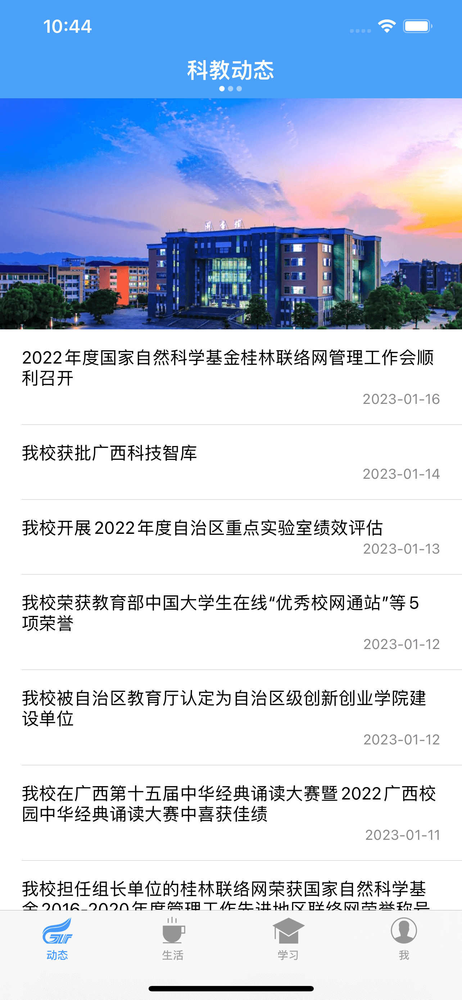
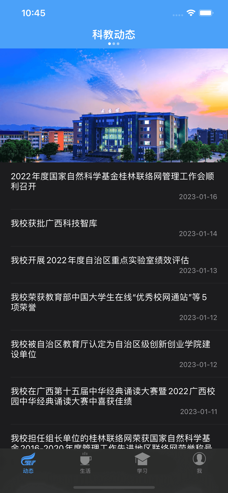
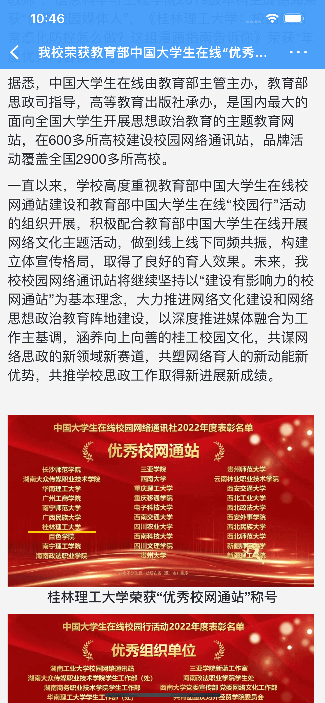
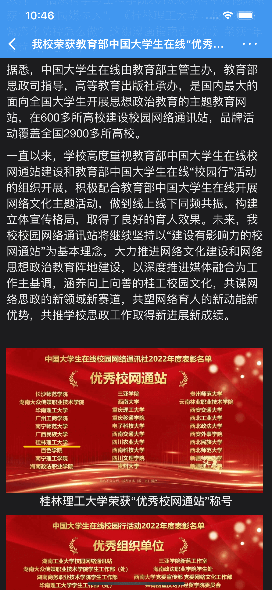
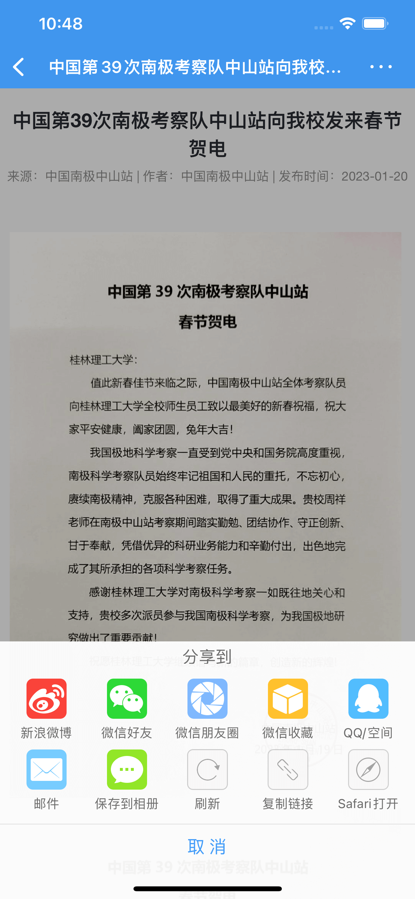
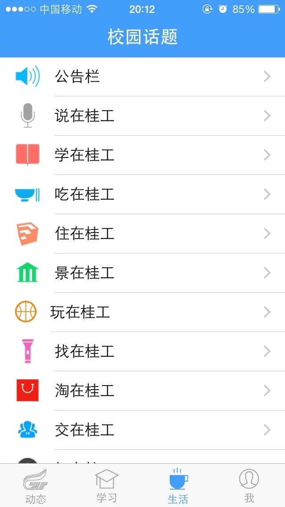

# CampusOfGLUT

### 介绍
桂林理工大学——校园通

### 实现
- 新闻模板主要是抓取学校的网页，然后解释html，保存到本地数据库，并渲染到模板显示出来。
- 说说模板主要实现有有图片和无图片展现cell，存取是利用高德地图作为免费空间【不再支持，[云图服务已下线](https://lbs.amap.com/api/yuntu/summary)】

### 下载
- [iOS App Store](https://itunes.apple.com/cn/app/gui-lin-li-gong-da-xue-xiao/id968615456?l=en&mt=8)

### 应用截图

|  |  |
| ----- | ----- |
|  |  |
|  |  |
|  |  |
